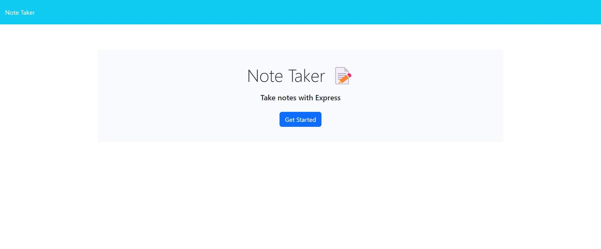
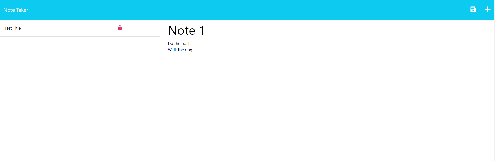

# Trevors-Note-Taker  
  

## Description  
Allow users to add, delete and look at notes.  

Homepage:  
  
Note page:


## Table of Contents  
* [Installation](#installation)  
* [Usage](#usage)  
* [Credits](#usage)  
* [License](#license)  
* [Contributing](#contributing)  
* [Tests](#tests)  
* [Questions](#questions)

## Installation  
To install necessary dependencies, run the following command:  

```  
npm install  
```  

## Usage  
Nothing  

## Credits  
Modified by: Trevor Blanchard  
Original file location: https://github.com/coding-boot-camp/miniature-eureka  
The link to the repo for this project is located at: https://github.com/blanchardt/trevors-note-taker  

### notes.js  

line 34:   
Went to https://stackoverflow.com/questions/61526572/express-js-delete-request to learn about delete requests.  Also credited in the README file.  
Christoffer Hennie, Davit, &amp; Syscall. (2020, April 30). Express.js delete request. Stack Overflow.   
&nbsp;&nbsp;&nbsp;&nbsp;&nbsp;https://stackoverflow.com/questions/61526572/express-js-delete-request  

line 43:  
Went to https://itsjavascript.com/get-the-index-of-an-object-in-an-array-in-javascript#:~:text=We%20can%20find%20the%20index,an%20object%20in%20an%20array.  
to figure out how to get a specific index of an object in an array.  Also credited in the README file.  
Srinivas, A. (2022, April 5). Get the index of an object in an array in JavaScript. ItsJavaScript.  
&nbsp;&nbsp;&nbsp;&nbsp;&nbsp;https://itsjavascript.com/get-the-index-of-an-object-in-an-array-in-javascript#:~:text=We%20can%20find%20the%20index,an%20object%20in%20an%20array.  

## License  
This project is licensed under the MIT license.  

## Contributing  
Nothing  

## Questions  
If you have any questions about the repo, open an issue or contact me directly at blanchardt@merrimack.edu.  You can find more of my work at [blanchardt](https://github.com/blanchardt/).  